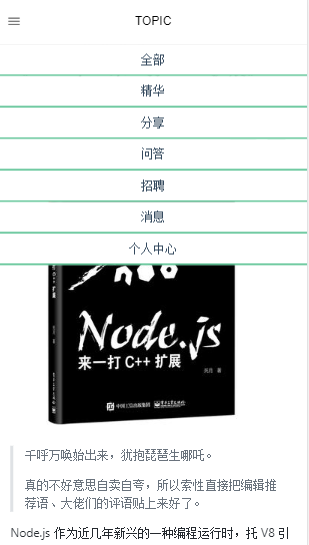

# Vue-Cnode
[在线地址](http://vuecnode.runtua.cn/)  




# TodoList
- √ 回复
- √ 登陆
- √ 发表
- × 点赞
- × 回复别人的回复
- × ....

## note
```javascript
- error："TypeError: Object doesn't support property or method 'scrollTo'"
- error-code：document.documentElement.scrollTo(0,0)
- fix：`edge` 不支持 `DOM scrollTo`

- error：ios 下拉刷新
- fix：`document.documentElement.scrollTop` => `document.body.scrollTop`
```

## Project setup

```
yarn install
```

### Compiles and hot-reloads for development

```
yarn run serve
```

### Compiles and minifies for production

```
yarn run build
```

### Lints and fixes files

```
yarn run lint
```
